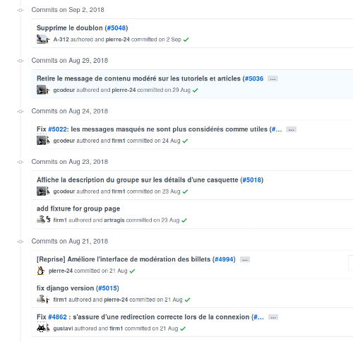

Le premier intérêt de la gestion de version, comme son nom l'indique, c'est de revenir à version antérieure facilement et rapidement. Dans le cadre d'un logiciel, certaines fonctionnalités cessent de fonctionner. Il est alors indispensable de revenir à la version précédente afin de corriger le problème. 

Mais il existe une autre facette : la gestion collaborative du projet. Il est possible d'être plusieurs personnes à travailler
simultanément sur un même projet. La gestion de version permet d'éviter de s'envoyer du code par e-mail ou par clef USB rendant les tâches de fusions et de suivi des modifications trop complexe.  C'est donc le logiciel de versionnement qui se chargera de la fusion des travaux des différents membres de l'équipe. 

Enfin, un projet peut-être ancien. On peut avoir besoin de parcourir son histoire : qui a rédigé cette fonctionnalité
? À quelle date ? À-t-elle été modifiée depuis ? Chaque modification du code source comporte un message du développeur, son nom ainsi que la date à laquelle la modification à eu lieue. Il est alors aisé de connaître l'histoire d'un projet.

Si je regarde le projet [Zeste de Savoir](https://github.com/zestedesavoir/zds-site/commits/dev), l'historique peut-ressembler à l'image ci-dessous. Comme on peut le voir, on à un petit descriptif de la modification, la date à laquelle elle a été faite, et l'auteur de la modification.

